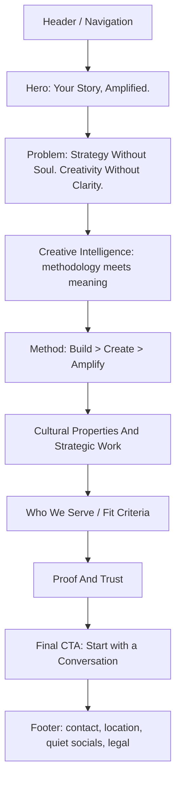
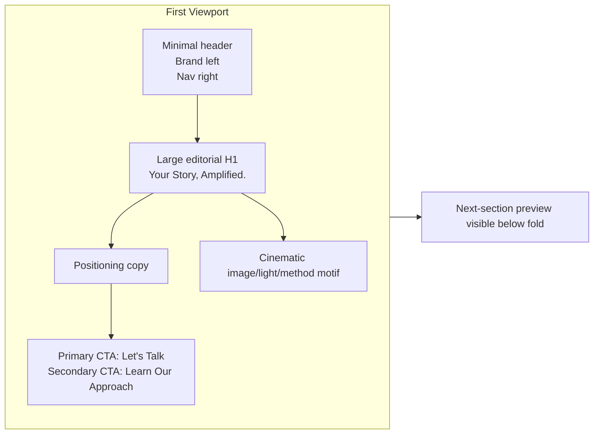
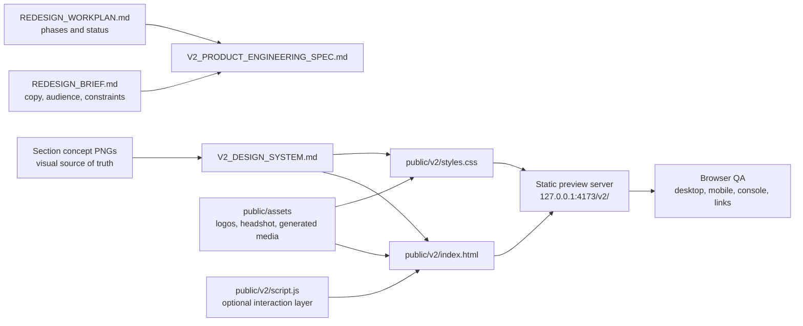
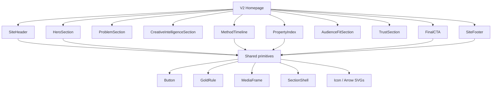
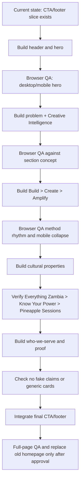

# Luminary Co. V2 Product And Engineering Spec

Status: active build spec  
Last updated: 2026-06-26  
Prototype path: `public/v2/`

## Purpose

This document connects the product requirement, site architecture, design system, and engineering plan for the Luminary Co. v2 homepage.

The goal is to build a premium homepage that positions Luminary Co. as Zambia's first Creative Intelligence Agency, not a generic creative/media agency.

## Source Docs

Use these documents as the current source package:

- `docs/REDESIGN_BRIEF.md` - product brief, audience, copy locks, acceptance criteria.
- `docs/REDESIGN_WORKPLAN.md` - build phases and current status.
- `docs/CONCEPT_DIRECTIONS.md` - selected hybrid direction.
- `docs/V2_DESIGN_SYSTEM.md` - tokens, typography, layout, imagery, motion, and component rules.
- `docs/concepts/hybrid-section-pass-01/REVIEW.md` - corrected section concept notes.
- `docs/concepts/hybrid-section-pass-01/*.png` - visual references for each section.

## Product Requirement

Build a one-page v2 homepage that does four things clearly:

1. Establish Luminary Co. as a premium Creative Intelligence Agency.
2. Explain Creative Intelligence as the fusion of design thinking methodology and storytelling heritage.
3. Show the operating model: Build > Create > Amplify.
4. Make it easy for the right prospect to start a conversation.

## Primary Audiences

- Corporate, NGO, and institutional leaders seeking a strategic creative partner.
- Ambitious brands and scale-ups seeking positioning, content, campaigns, and influence.
- Creators and cultural partners seeking infrastructure, storytelling, and amplification.
- Future collaborators, funders, and team members evaluating credibility.

## Core Positioning

```text
Your Story, Amplified.

Zambia's first Creative Intelligence Agency, fusing design thinking methodology with storytelling heritage to build, create, and amplify brands shaping Africa's narrative.
```

## Site Structure



## First Viewport Layout



## Page Section Intent

| Section | Job | Build Notes |
| --- | --- | --- |
| Header | Establish brand and wayfinding. | Quiet, sticky or fixed, no extra badges. |
| Hero | Land the repositioning immediately. | Code-native copy, premium image/light composition, no old overlay card. |
| Problem | Name the category gap. | Should feel like strategy, not a generic services intro. |
| Creative Intelligence | Define the core idea. | Brain/heart/fusion logic; elegant system, not dashboard chrome. |
| Build > Create > Amplify | Make the method memorable. | Desktop horizontal method; mobile stacked sequence. |
| Cultural Properties | Show owned platforms and strategic work. | Everything Zambia, Know Your Power, Pineapple Sessions in that order. |
| Who We Serve | Help visitors self-identify. | Focus on fit, not generic industry cards. |
| Proof And Trust | Build credibility without fake claims. | Method, standards, Lusaka base, founder leadership. |
| Final CTA | Convert interest into conversation. | One emotional close; `Let's Talk` opens direct Call / WhatsApp options. |
| Footer | Practical contact and legal surface. | Email, WhatsApp, phone, Lusaka, disabled socials, 2026 copyright. |

## Technical Stack

### Current Approved Build Path

Use a static v2 prototype inside the current project:

```text
public/v2/index.html
public/v2/styles.css
public/v2/script.js
public/v2/assets/
```

Current implementation:

- HTML: semantic static HTML in `public/v2/index.html`.
- CSS: custom CSS in `public/v2/styles.css`.
- JavaScript: optional vanilla JS in `public/v2/script.js` when needed for nav, scroll state, reveal motion, or method interaction.
- Fonts: Google Fonts currently using `Cormorant Garamond` and `Inter`.
- Assets: shared repo assets in `public/assets/`, including the approved 2026 headshot at `public/assets/images/about/founders/chawana_maseka_2026.png`.
- Local preview: static server from `public/`, currently `http://127.0.0.1:4173/v2/`.
- QA: curl checks, browser screenshots, desktop/mobile viewport checks, console check.

### Why Static First

Static first is the right choice now because:

- The v2 homepage is mostly editorial and marketing content.
- It is faster to teach and inspect section by section.
- It preserves the old homepage while v2 is built.
- It avoids framework complexity before the full page is approved.
- It can still be deployed by serving the `public/` directory.

### When To Move To React + Vite

Move to React + Vite later if one of these becomes true:

- The site becomes a multi-page system with reusable page templates.
- Work/case studies need structured data and filtering.
- Cultural properties need dynamic content.
- We add richer interactions that are awkward in vanilla JS.
- We want reusable components as a teaching goal after the design is locked.

## Engineering Architecture



## Component Boundaries

For static v2, these are CSS class/component families. If we later move to React, they become component boundaries.



## Build Sequence



## Locked Content Rules

- Hero headline: `Your Story, Amplified.`
- Category: `Zambia's first Creative Intelligence Agency`.
- Method: `Build > Create > Amplify`.
- Pillars: `Design Thinking Rigor`, `Storytelling Heritage`, `Cultural Alchemy`.
- Contact email: `hello@luminaryco.net`.
- WhatsApp URL: `https://wa.me/260974651180`.
- Phone URL: `tel:+260974651180`.
- `Let's Talk` CTAs open a contact-choice panel with WhatsApp and Call actions.
- Location: `Lusaka, Zambia`.
- Footer copyright: `© 2026 Luminary Co. All rights reserved.`
- Social labels: Instagram, LinkedIn, X, TikTok, YouTube.
- Social links stay disabled until URLs are verified.
- Cultural properties order: Everything Zambia, Know Your Power, Pineapple Sessions.
- Do not use `Community Engine` on the public v2 homepage.
- Do not use the old Chawana portrait in new v2 work.
- Do not use Chawana's headshot in the final CTA / contact section.
- Do not use the full street address in v2.

## QA Gates

Every section must pass these checks before the next section is considered done:

1. Copy matches the source docs.
2. Assets load without console errors.
3. Desktop viewport has no overlap or clipping.
4. Mobile viewport has no horizontal overflow.
5. Buttons and links use real intended targets.
6. Socials are visible but non-clickable until verified.
7. Browser screenshot is compared against the relevant concept image.
8. No old design shell patterns return: no hero overlay card, no pill buttons, no generic service-card grid.

## Current Status

Done:

- Redesign brief.
- Workplan.
- Concept direction.
- Section concept pass.
- Design system draft.
- Contact/social lock.
- Approved 2026 headshot added.
- Static v2 header and hero slice built.
- Static v2 CTA/footer slice built.
- Static v2 middle sections built:
  - Problem / category gap.
  - Creative Intelligence.
  - Build > Create > Amplify.
  - Cultural properties.
  - Who We Serve.
  - Proof And Trust.

Next:

1. Review the full v2 homepage in the browser.
2. Polish section spacing, crops, and responsive details from design review.
3. Complete launch QA across links, assets, desktop, mobile, and console.
4. Replace the old homepage only after full v2 approval.
